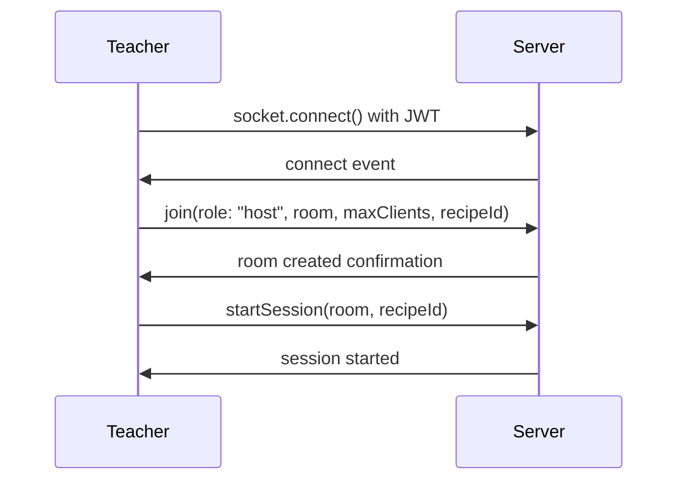
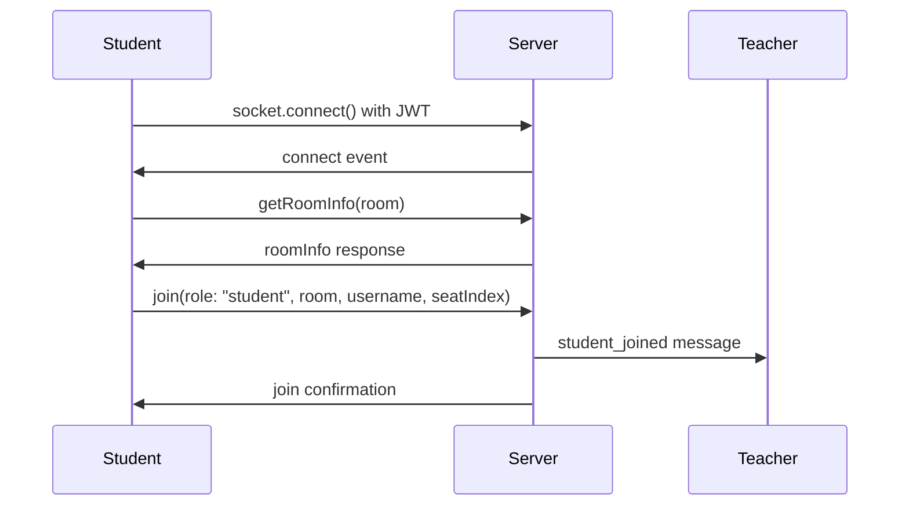

# 料理教室管理システム Socket.IO API ドキュメント

## ユーザー管理のAPI ドキュメントは[こちら](api.md)

## 目次

- [概要](#概要)
- [認証](#認証)
- [接続フロー](#接続フロー)
- [イベント詳細](#イベント詳細)
- [エラーハンドリング](#エラーハンドリング)
- [実装例](#実装例)
- [ベストプラクティス](#ベストプラクティス)

---

## 概要

この API は料理教室のオンライン授業を管理するためのリアルタイム通信システムです。Socket.IO を使用して、教師（host）と生徒（student）間の双方向通信を実現します。

### 主な機能

- ルーム管理（作成・参加・退出）
- セッション管理（開始・終了）
- 進捗トラッキング
- 危険通知システム
- 座席管理

---

## 認証

### JWT 認証が必要

すべての接続には JWT トークンによる認証が必要です。

```javascript
// 接続時に認証トークンを提供
const socket = io("http://localhost:3000", {
  auth: {
    token: "eyJhbGciOiJIUzI1NiIsInR5cCI6IkpXVCJ9...",
  },
});

// 認証エラーの処理
socket.on("connect_error", (error) => {
  if (error.message === "トークンが必要です") {
    console.error("認証トークンが提供されていません");
  } else if (error.message === "無効なトークンです") {
    console.error("認証トークンが無効です");
  }
});
```

### トークン要件

- **アルゴリズム**: HS256
- **必須クレーム**: ユーザー識別情報
- **有効期限**: 推奨は 1 時間以内

---

## 接続フロー

### 1. 教師（Host）の接続フロー



### 2. 生徒（Student）の接続フロー



---

## イベント詳細

## 📝 ルーム管理

### `join` - ルーム参加

**概要**: ユーザーがルームに参加します。教師の場合はルームを作成し、生徒の場合は既存ルームに参加します。

**送信者**: Client → Server

#### パラメータ

| フィールド   | 型                    | 必須 | 説明                          | 適用対象   |
| ------------ | --------------------- | ---- | ----------------------------- | ---------- |
| `role`       | `"host" \| "student"` | ✅   | ユーザーの役割                | 共通       |
| `room`       | `string`              | ✅   | ルーム名                      | 共通       |
| `username`   | `string`              | -    | ユーザー名                    | 共通       |
| `maxClients` | `number`              | -    | 最大参加者数（デフォルト: 5） | ホストのみ |
| `seatIndex`  | `number`              | -    | 希望座席番号（0 から開始）    | 生徒のみ   |
| `recipeId`   | `string`              | -    | 使用するレシピ ID             | ホストのみ |

#### 使用例

**教師がルームを作成する場合:**

```javascript
socket.emit("join", {
  role: "host",
  room: "cooking-class-001",
  username: "田中先生",
  maxClients: 10,
  recipeId: "recipe-pasta-001",
});

// 成功時はレスポンスなし
// エラー時は message イベントで通知
socket.on("message", (data) => {
  if (data.type === "error") {
    console.error("ルーム作成エラー:", data.message);
  }
});
```

**生徒がルームに参加する場合:**

```javascript
socket.emit("join", {
  role: "student",
  room: "cooking-class-001",
  username: "山田太郎",
  seatIndex: 3,
});

// 参加成功時、他の参加者に通知される
socket.on("message", (data) => {
  if (data.type === "student_joined") {
    console.log(`${data.username}さんが座席${data.seatIndex}に参加しました`);
  }
});
```

#### エラーケース

| エラータイプ     | 説明                         | 対象 |
| ---------------- | ---------------------------- | ---- |
| `room_not_found` | 指定されたルームが存在しない | 生徒 |
| `room_full`      | ルームが満室                 | 生徒 |
| `seat_occupied`  | 指定座席が既に使用中         | 生徒 |
| `invalid_seat`   | 無効な座席番号               | 生徒 |

---

### `getRoomInfo` - ルーム情報取得

**概要**: 指定したルームの現在の状況（座席情報等）を取得します。

**送信者**: Client → Server

#### パラメータ

```typescript
{
  room: string; // 情報を取得したいルーム名
}
```

#### レスポンス: `roomInfo` イベント

```typescript
{
  success: boolean,        // 取得成功フラグ
  message?: string,        // エラーメッセージ
  maxSeats?: number,       // 最大座席数（ホスト除く）
  occupiedSeats?: number[] // 占有済み座席番号の配列
}
```

#### 使用例

```javascript
// ルーム情報を取得
socket.emit("getRoomInfo", { room: "cooking-class-001" });

// レスポンスを受信
socket.on("roomInfo", (data) => {
  if (data.success) {
    console.log("最大座席数:", data.maxSeats);
    console.log("占有済み座席:", data.occupiedSeats);

    // 利用可能な座席を計算
    const availableSeats = [];
    for (let i = 0; i < data.maxSeats; i++) {
      if (!data.occupiedSeats.includes(i)) {
        availableSeats.push(i);
      }
    }
    console.log("利用可能座席:", availableSeats);
  } else {
    console.error("ルーム情報取得エラー:", data.message);
  }
});
```

---

## 🎓 セッション管理

### `startSession` - セッション開始

**概要**: 教師がセッションを開始し、生徒側にレシピと開始通知を送信します。

**権限**: ホストのみ

**送信者**: Client → Server

#### パラメータ

```typescript
{
  room: string,     // ルーム名
  recipeId: string  // 開始するレシピのID
}
```

#### 全員に送信される通知: `sessionStarted` イベント

```typescript
{
  recipeId: string, // レシピID
  room: string      // ルーム名
}
```

#### 使用例

```javascript
// 教師側: セッションを開始
socket.emit("startSession", {
  room: "cooking-class-001",
  recipeId: "recipe-pasta-001",
});

// 全参加者（教師・生徒）が受信
socket.on("sessionStarted", (data) => {
  console.log(`セッション開始: レシピID ${data.recipeId}`);

  // 生徒側での処理例
  if (userRole === "student") {
    loadRecipe(data.recipeId);
    showSessionStartModal();
  }

  // 教師側での処理例
  if (userRole === "host") {
    updateSessionStatus("active");
    enableSessionControls();
  }
});
```

### `endSession` - セッション終了

**概要**: 教師がセッションを終了します。

**権限**: ホストのみ

#### 使用例

```javascript
// 教師側: セッション終了
socket.emit("endSession", {
  room: "cooking-class-001",
});

// 全参加者が受信
socket.on("sessionEnded", (data) => {
  console.log("セッションが終了しました");

  // 生徒側での処理
  if (userRole === "student") {
    showSessionEndModal();
    saveProgress();
  }

  // 教師側での処理
  if (userRole === "host") {
    updateSessionStatus("ended");
    generateReport();
  }
});
```

---

## 📊 進捗管理

### `studentProgress` - 生徒進捗更新

**概要**: 生徒が料理の進捗を更新し、教師に通知します。

**送信者**: Client → Server（生徒のみ）

#### パラメータ

```typescript
{
  room: string,         // ルーム名
  userId: string,       // 生徒のユーザーID
  username: string,     // 生徒の名前
  seatIndex: number,    // 座席番号
  currentStep: number,  // 現在のステップ番号
  recipeId: string      // レシピID
}
```

#### 教師が受信: `studentProgress` イベント

```typescript
{
  userId: string,       // 生徒のユーザーID
  username: string,     // 生徒の名前
  seatIndex: number,    // 座席番号
  currentStep: number,  // 現在のステップ番号
  recipeId: string,     // レシピID
  timeStamp: string     // 更新時刻（ISO文字列）
}
```

#### 使用例

**生徒側: 進捗を送信**

```javascript
// ステップ完了時に呼び出される関数
function onStepCompleted(stepNumber) {
  socket.emit("studentProgress", {
    room: currentRoom,
    userId: socket.id,
    username: currentUser.username,
    seatIndex: currentUser.seatIndex,
    currentStep: stepNumber,
    recipeId: currentRecipe.id,
  });

  console.log(`ステップ${stepNumber}完了を報告しました`);
}

// 使用例
onStepCompleted(3); // ステップ3完了を報告
```

**教師側: 進捗を受信**

```javascript
socket.on("studentProgress", (data) => {
  console.log(
    `${data.username}さん（座席${data.seatIndex}）がステップ${data.currentStep}を完了`
  );

  // 進捗を画面に反映
  updateStudentProgressUI(data.seatIndex, data.currentStep);

  // 遅れている生徒に注意を向ける
  const averageProgress = calculateAverageProgress();
  if (data.currentStep < averageProgress - 2) {
    highlightStudentNeedsHelp(data.seatIndex);
  }
});

// 進捗管理の例
const progressTracker = new Map();

socket.on("studentProgress", (data) => {
  progressTracker.set(data.userId, {
    username: data.username,
    seatIndex: data.seatIndex,
    currentStep: data.currentStep,
    lastUpdate: data.timeStamp,
  });

  // 進捗レポート生成
  generateProgressReport();
});
```

---

## ⚠️ 安全管理

### `dangerAlert` - 危険通知

**概要**: 生徒が危険な状況に遭遇した際に教師に緊急通知を送信します。

**送信者**: Client → Server（生徒のみ）

#### パラメータ

```typescript
{
  room: string,         // ルーム名
  userId: string,       // 生徒のユーザーID
  username: string,     // 生徒の名前
  seatIndex: number,    // 座席番号
  message?: string      // 詳細メッセージ（オプション）
}
```

#### 使用例

**生徒側: 危険通知の送信**

```javascript
// 緊急ボタンがクリックされた時
function sendDangerAlert(alertType) {
  const alertMessages = {
    fire: "火災が発生しました",
    cut: "怪我をしました",
    spill: "熱湯をこぼしました",
    other: "緊急事態です",
  };

  socket.emit("dangerAlert", {
    room: currentRoom,
    userId: socket.id,
    username: currentUser.username,
    seatIndex: currentUser.seatIndex,
    message: alertMessages[alertType] || "緊急事態です",
  });

  // 生徒側でも緊急状態を表示
  showEmergencyMode();
}

// HTML例
/*
<div class="emergency-buttons">
  <button onclick="sendDangerAlert('fire')" class="btn-emergency">🔥 火災</button>
  <button onclick="sendDangerAlert('cut')" class="btn-emergency">🩸 怪我</button>
  <button onclick="sendDangerAlert('spill')" class="btn-emergency">💧 やけど</button>
  <button onclick="sendDangerAlert('other')" class="btn-emergency">⚠️ その他</button>
</div>
*/
```

**教師側: 危険通知の受信**

```javascript
socket.on("dangerAlert", (data) => {
  // 最優先で処理
  console.error(`🚨 緊急通知: ${data.username}さん（座席${data.seatIndex}）`);
  console.error(`詳細: ${data.message}`);

  // 画面に緊急警告を表示
  showEmergencyAlert({
    student: data.username,
    seat: data.seatIndex,
    message: data.message,
    time: data.timeStamp,
  });

  // 音声アラートも再生
  playEmergencySound();

  // 該当座席を強調表示
  highlightEmergencySeat(data.seatIndex);
});

// 緊急通知UI例
function showEmergencyAlert(alertData) {
  const alertHtml = `
    <div class="emergency-alert">
      <h3>🚨 緊急通知</h3>
      <p><strong>生徒:</strong> ${alertData.student}</p>
      <p><strong>座席:</strong> ${alertData.seat}</p>
      <p><strong>状況:</strong> ${alertData.message}</p>
      <p><strong>時刻:</strong> ${new Date(
        alertData.time
      ).toLocaleTimeString()}</p>
      <button onclick="handleEmergency(${alertData.seat})">対応完了</button>
    </div>
  `;

  document.getElementById("emergency-notifications").innerHTML = alertHtml;
}
```

---

## 💺 座席管理

### `changeSeat` - 座席変更

**概要**: 生徒が座席を変更します。

**権限**: 生徒のみ

#### 使用例

```javascript
// 座席変更
function changeSeat(newSeatIndex) {
  socket.emit("changeSeat", {
    room: currentRoom,
    newSeatIndex: newSeatIndex,
  });
}

// 座席変更結果を受信
socket.on("message", (data) => {
  switch (data.type) {
    case "seat_changed":
      console.log("座席変更が完了しました");
      updateCurrentSeat(data.newSeatIndex);
      break;
    case "seat_occupied":
      alert("選択した座席は既に使用されています");
      break;
    case "invalid_seat":
      alert("無効な座席番号です");
      break;
  }
});

// 座席状況の更新を受信
socket.on("seatUpdate", (data) => {
  updateSeatMapUI(data.occupiedSeats);
});
```

---

## エラーハンドリング

### 接続エラー

```javascript
socket.on("connect_error", (error) => {
  switch (error.message) {
    case "トークンが必要です":
      redirectToLogin();
      break;
    case "無効なトークンです":
      refreshToken();
      break;
    default:
      console.error("接続エラー:", error.message);
  }
});
```

### イベントエラー

```javascript
socket.on("message", (data) => {
  const errorHandlers = {
    room_not_found: () => alert("ルームが見つかりません"),
    room_full: () => alert("ルームが満室です"),
    seat_occupied: () => alert("座席が既に使用されています"),
    invalid_seat: () => alert("無効な座席です"),
    error: () => alert(data.message || "不明なエラー"),
  };

  const handler = errorHandlers[data.type];
  if (handler) {
    handler();
  }
});
```

---

## 実装例

### 完全な教師側実装

```javascript
class TeacherSocket {
  constructor(token) {
    this.socket = io("http://localhost:3000", {
      auth: { token: token },
    });
    this.students = new Map();
    this.setupEventListeners();
  }

  setupEventListeners() {
    // 接続成功
    this.socket.on("connect", () => {
      console.log("教師として接続しました");
      this.createRoom();
    });

    // 生徒参加通知
    this.socket.on("message", (data) => {
      if (data.type === "student_joined") {
        this.onStudentJoined(data);
      }
    });

    // 進捗受信
    this.socket.on("studentProgress", (data) => {
      this.updateStudentProgress(data);
    });

    // 危険通知受信
    this.socket.on("dangerAlert", (data) => {
      this.handleEmergency(data);
    });
  }

  createRoom() {
    this.socket.emit("join", {
      role: "host",
      room: "cooking-class-001",
      username: "田中先生",
      maxClients: 10,
      recipeId: "recipe-pasta-001",
    });
  }

  startSession() {
    this.socket.emit("startSession", {
      room: "cooking-class-001",
      recipeId: "recipe-pasta-001",
    });
  }

  onStudentJoined(data) {
    this.students.set(data.userId, {
      username: data.username,
      seatIndex: data.seatIndex,
      currentStep: 0,
      status: "joined",
    });
    this.updateStudentsList();
  }

  updateStudentProgress(data) {
    const student = this.students.get(data.userId);
    if (student) {
      student.currentStep = data.currentStep;
      student.lastUpdate = data.timeStamp;
      this.updateProgressDisplay(data.seatIndex, data.currentStep);
    }
  }

  handleEmergency(data) {
    // 最優先処理
    this.showEmergencyAlert(data);
    this.highlightStudent(data.seatIndex);
    this.playEmergencySound();
  }
}

// 使用例
const teacher = new TeacherSocket(userToken);
```

### 完全な生徒側実装

```javascript
class StudentSocket {
  constructor(token, username) {
    this.socket = io("http://localhost:3000", {
      auth: { token: token },
    });
    this.username = username;
    this.currentStep = 0;
    this.setupEventListeners();
  }

  setupEventListeners() {
    this.socket.on("connect", () => {
      this.joinRoom();
    });

    this.socket.on("sessionStarted", (data) => {
      this.startCooking(data.recipeId);
    });

    this.socket.on("message", (data) => {
      this.handleMessage(data);
    });
  }

  async joinRoom() {
    // まずルーム情報を取得
    this.socket.emit("getRoomInfo", { room: "cooking-class-001" });

    this.socket.on("roomInfo", (data) => {
      if (data.success) {
        const availableSeats = this.findAvailableSeats(
          data.maxSeats,
          data.occupiedSeats
        );
        const selectedSeat = availableSeats[0]; // 最初の利用可能座席

        this.socket.emit("join", {
          role: "student",
          room: "cooking-class-001",
          username: this.username,
          seatIndex: selectedSeat,
        });
      }
    });
  }

  findAvailableSeats(maxSeats, occupiedSeats) {
    const available = [];
    for (let i = 0; i < maxSeats; i++) {
      if (!occupiedSeats.includes(i)) {
        available.push(i);
      }
    }
    return available;
  }

  completeStep(stepNumber) {
    this.currentStep = stepNumber;
    this.socket.emit("studentProgress", {
      room: "cooking-class-001",
      userId: this.socket.id,
      username: this.username,
      seatIndex: this.seatIndex,
      currentStep: stepNumber,
      recipeId: this.currentRecipeId,
    });
  }

  reportEmergency(type) {
    this.socket.emit("dangerAlert", {
      room: "cooking-class-001",
      userId: this.socket.id,
      username: this.username,
      seatIndex: this.seatIndex,
      message: `緊急事態: ${type}`,
    });
  }
}

// 使用例
const student = new StudentSocket(userToken, "山田太郎");
```

---

## ベストプラクティス

### 1. 接続管理

```javascript
// 自動再接続の設定
const socket = io("http://localhost:3000", {
  auth: { token: userToken },
  autoConnect: true,
  reconnection: true,
  reconnectionDelay: 1000,
  reconnectionDelayMax: 5000,
  maxReconnectionAttempts: 5,
});

// 接続状態の監視
socket.on("disconnect", (reason) => {
  if (reason === "io server disconnect") {
    // サーバーから切断された場合、手動で再接続
    socket.connect();
  }
});
```

### 2. エラーハンドリング

```javascript
// 包括的なエラーハンドリング
socket.on("error", (error) => {
  console.error("Socket error:", error);
  // ユーザーに分かりやすい形でエラーを表示
  showUserFriendlyError(error);
});

// タイムアウト処理
function emitWithTimeout(event, data, timeout = 5000) {
  return new Promise((resolve, reject) => {
    const timer = setTimeout(() => {
      reject(new Error("タイムアウト"));
    }, timeout);

    socket.emit(event, data, (response) => {
      clearTimeout(timer);
      resolve(response);
    });
  });
}
```

### 3. パフォーマンス最適化

```javascript
// 進捗更新の頻度制限
const throttledProgressUpdate = _.throttle((stepData) => {
  socket.emit("studentProgress", stepData);
}, 1000); // 1秒に1回まで

// バッチ処理
const pendingAlerts = [];
const batchSendAlerts = _.debounce(() => {
  if (pendingAlerts.length > 0) {
    socket.emit("batchAlert", pendingAlerts);
    pendingAlerts.length = 0;
  }
}, 500);
```
